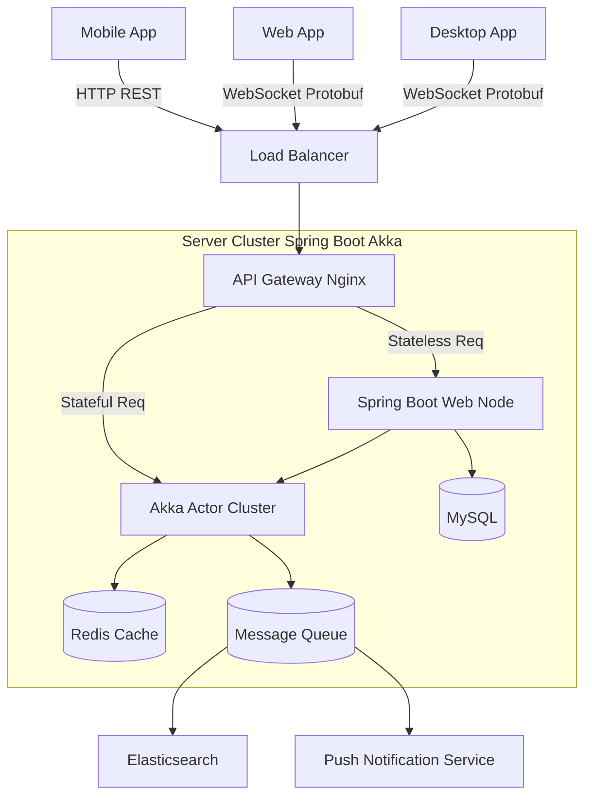

# 项目架构概览 (Architecture Overview)

## 1. 设计目标
构建一个高并发、低延迟、支持多端实时同步 (Sync) 的 GTD (Getting Things Done) 效率工具。核心体验目标是 **"离线可用，即时同步"**。

## 2. 系统架构图 (逻辑视图)

## 3. 技术栈选型

### 3.1 服务端 (Server)
*   **核心框架**: **Spring Boot + Akka**
    *   **Spring Boot**: 负责无状态业务逻辑（用户认证、支付、报表、静态配置），利用其成熟的生态（Spring Security, JPA/MyBatis）。
    *   **Akka**: 负责高并发、有状态的长连接业务（实时同步、在线状态、协作冲突解决）。利用 Actor 模型处理每个用户的收件箱状态。
*   **通信协议**:
    *   **HTTP/JSON**: 用于低频、非核心交互（登录、设置、文件上传）。
    *   **WebSocket + Protobuf**: 用于核心数据同步（任务增删改），追求极致的小包体和解析速度。
*   **存储层**:
    *   **MySQL 8.0+**: 存储核心关系型数据（User, Task, List）。
    *   **Redis**: 用户在线状态 Session、Sync Token 缓存、分布式锁。
    *   **Elasticsearch**: 任务全文检索。

### 3.2 客户端 (Client)
*   **技术框架**: **Flutter** (推荐) 或 React Native。实现一套代码覆盖 iOS/Android/Desktop。
*   **本地存储 (关键)**: **SQLite** (配合 Drift 或 Sqflite) 或 Realm。
    *   **离线优先 (Local-First)**: 所有读写操作优先走本地数据库，后台异步同步。

## 4. 核心数据流 (Sync Flow)
1.  **修改**: 用户在客户端修改任务 -> 写入本地 SQLite -> 放入 Sync Queue。
2.  **推送**: Sync Engine 检测到网络可用 -> 通过 WebSocket 发送 Protobuf 变更包 (Delta) 给 Server。
3.  **处理**: Akka Actor 接收变更 -> 解决版本冲突 (Vector Clock / Last Write Wins) -> 写入 MySQL -> 推送给该用户其他在线设备。
4.  **拉取**: 其他设备收到变更通知 -> 应用变更到本地 SQLite -> 刷新 UI。
