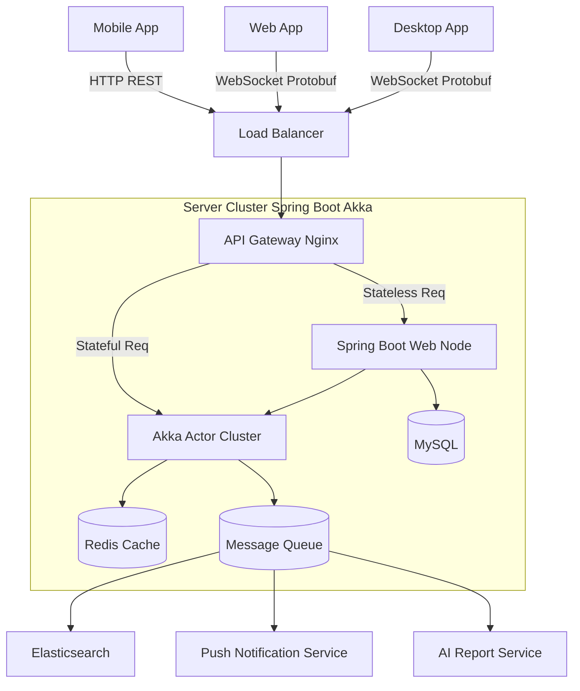

# 项目架构概览 (Architecture Overview)

## 1. 设计目标

构建一个高并发、低延迟、支持多端实时同步 (Sync) 的 GTD (Getting Things Done) 效率工具。

核心体验目标：

* **"离线可用，即时同步"** — 所有写操作直接落本地，后台异步推送云端。
* **"产品语言对齐 Things"** — 视图体系（Inbox / Today / Upcoming / Anytime / Someday / Logbook）、组织结构（Area > Project > Heading > Task > Checklist）、时间三轴（When / Deadline / Reminder）。
* **"一份代码，多端原生"** — Flutter 单代码库覆盖 iOS / iPadOS / macOS / Android（Windows/Linux 后置评估），按屏幕宽度自适应 Mobile / Tablet / Desktop 三档布局。

> 落地路线图见 `flowlog_design/refactor/00_Overview.md`（M1–M4），当前现状见 `07_Current_Technical_Architecture.md`。

## 2. 系统架构图 (逻辑视图)

## 3. 技术栈选型

### 3.1 服务端 (Server)
*   **核心框架**: **Spring Boot + Akka**
    *   **Spring Boot**: 负责无状态业务逻辑（设备注册/配对、支付、报表、静态配置），利用其成熟的生态（Spring Security, JPA/MyBatis）。
    *   **Akka**: 负责高并发、有状态的长连接业务（实时同步、在线状态、协作冲突解决）。利用 Actor 模型处理每个用户的收件箱状态。
*   **通信协议**:
    *   **HTTP/JSON**: 用于低频、非核心交互（设备注册/配对、设置、文件上传）。
    *   **WebSocket + Protobuf**: 用于核心数据同步（任务增删改），追求极致的小包体和解析速度。
*   **存储层**:
    *   **MySQL 8.0+**: 存储核心关系型数据（Account, Task, List）。
    *   **Redis**: 设备在线状态 Session、Sync Token 缓存、分布式锁。
    *   **Elasticsearch**: 任务全文检索。

### 3.2 客户端 (Client)
*   **技术框架**: **Flutter / Dart**。一份代码覆盖 iOS / iPadOS / macOS / Android。
*   **本地存储 (关键)**: **SQLite + Drift**。
    *   **离线优先 (Local-First)**: 所有读写操作优先走本地数据库，后台异步同步。
*   **自适应 Shell**：顶层按屏幕宽度分发到三档布局：
    *   `< 600`：MobileShell（底部 Tab + 全屏详情）
    *   `600–1000`：TabletShell（双栏 Sidebar+Content）
    *   `≥ 1000`：DesktopShell（三栏 Sidebar+List+常驻 DetailPane）
*   **平台抽象**：全局热键、通知、窗口装饰收敛在 `lib/services/` 与 `lib/platform/` 接口后；Material You 在 Android 12+ 通过 `dynamic_color` 接入。

## 4. 产品语言（对齐 Things）

服务端与客户端共享同一套产品概念，避免协议层与 UI 层语义错位：

| 概念 | 含义 | 数据载体 |
|---|---|---|
| **Area** | 项目分组（"工作 / 生活 / 学习"） | `areas` 表 |
| **Project** | 清单 / 大目标 | `projects` 表，含 `area_id` |
| **Heading** | 项目内分节标题 | `headings` 表 |
| **Task** | 待办任务 | `tasks` 表，含 `project_id` / `heading_id` |
| **Subtask** | 子任务（独立任务，进入视图） | `tasks(parent_id)` |
| **Checklist** | 任务内勾选项（不进入视图） | `checklists` 表 |
| **When** | 计划做的日期/语义（today/evening/someday/scheduled） | `tasks.when_type` + `due_date` |
| **Deadline** | 必须前完成（与 When 解耦） | `tasks.deadline` |
| **Reminder** | 提醒时刻（与 When 解耦） | `tasks.reminder_at` |
| **Logbook** | 已完成历史 | `tasks.in_logbook` + `status=Done` |

固定视图：**Inbox / Today（含 This Evening）/ Upcoming / Anytime / Someday / Logbook** + 动态 Areas/Projects + Trash/Settings 工具入口。

## 5. 核心数据流 (Sync Flow)
1.  **修改**: 用户在客户端修改任务 -> 写入本地 SQLite（`is_dirty=1`）-> 放入 Sync Queue（`mutations` 表）。
2.  **推送**: Sync Engine 检测到网络可用 -> 通过 WebSocket 发送 Protobuf 变更包 (Delta) 给 Server。
3.  **处理**: Akka Actor 接收变更 -> 解决版本冲突 (`etag` / Last Write Wins) -> 写入 MySQL -> 推送给该用户其他在线设备。
4.  **拉取**: 其他设备收到变更通知 -> 应用变更到本地 SQLite -> 刷新 UI。

> 同步实体不再仅是 Task，还包括 Area / Project / Heading / Checklist / Tag。每个实体都有独立的 `etag` 与 `is_dirty` 标记，按"实体 + 操作类型"打包。

## 6. 无账号多端同步（设备配对）
1.  **设备注册**: 首次启动向服务端注册设备，获取 `device_id` + `device_token`。
2.  **配对流程**:
    *   主设备生成短效 `pair_code/QR`。
    *   新设备输入/扫码 `pair_code`，加入同一 `account_id`。
3.  **同步**:
    *   **Push**: 客户端提交本地变更 -> Server 生成 `server_checkpoint` -> 回 ACK。
    *   **Fan-out**: Server 将变更推送到同一 `account_id` 的其他在线设备。
    *   **Pull**: 新设备首次配对走 `full_sync` 获取快照，后续走增量。
4.  **冲突处理**: 以 `update_time`/`etag` 为主的 LWW，必要时保留冲突记录供用户选择。
5.  **安全**: `device_token` 存储在 Keychain/Keystore；配对码短效；所有同步通道 TLS 加密。
6.  **后续可选**: 绑定邮箱/手机号升级为账号体系（非 MVP）。

## 7. AI 报告能力 (周报/月报/年报)
1.  **数据准备**: 任务完成情况、专注统计、清单/标签分布等结构化数据。
2.  **生成方式**:
    *   **定时生成**: 服务器按周/月/年触发 Job，生成报告并缓存。
    *   **按需生成**: 客户端请求最新周期，若无缓存则即时生成。
3.  **AI 服务**: AI Report Service 负责提示词模板、摘要生成、结构化输出。
4.  **结果存储**: 报告写入 `ai_reports` 表并支持版本更新与回溯。
5.  **隐私**: 默认最小化数据上传，支持脱敏、开关与删除。
