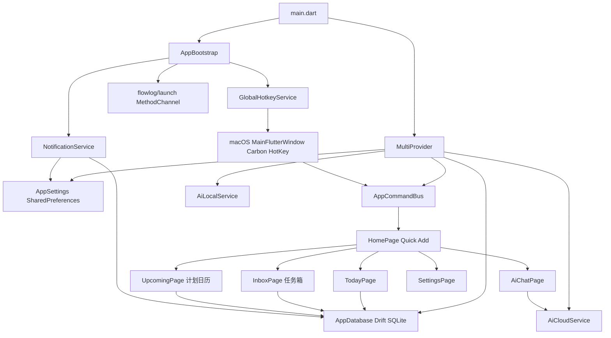
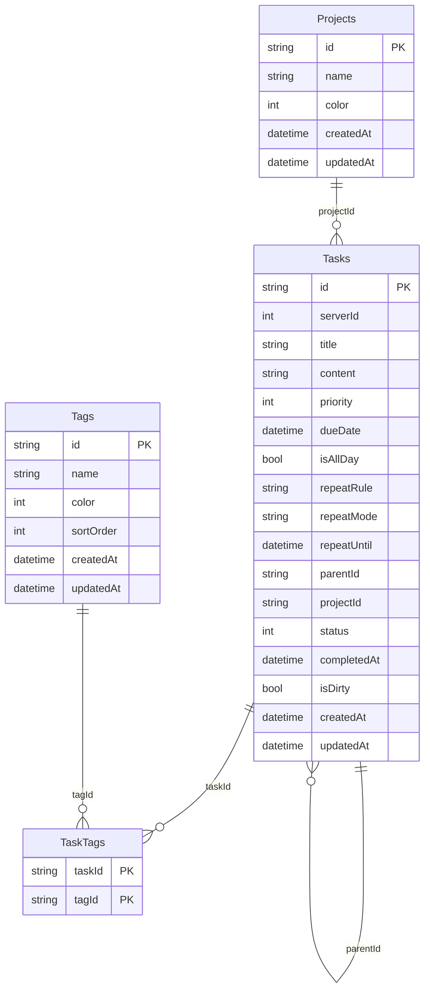
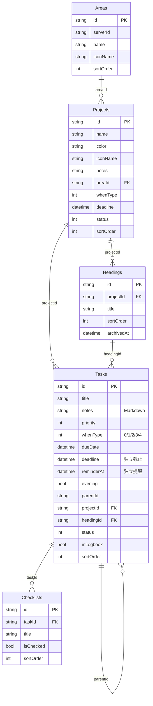
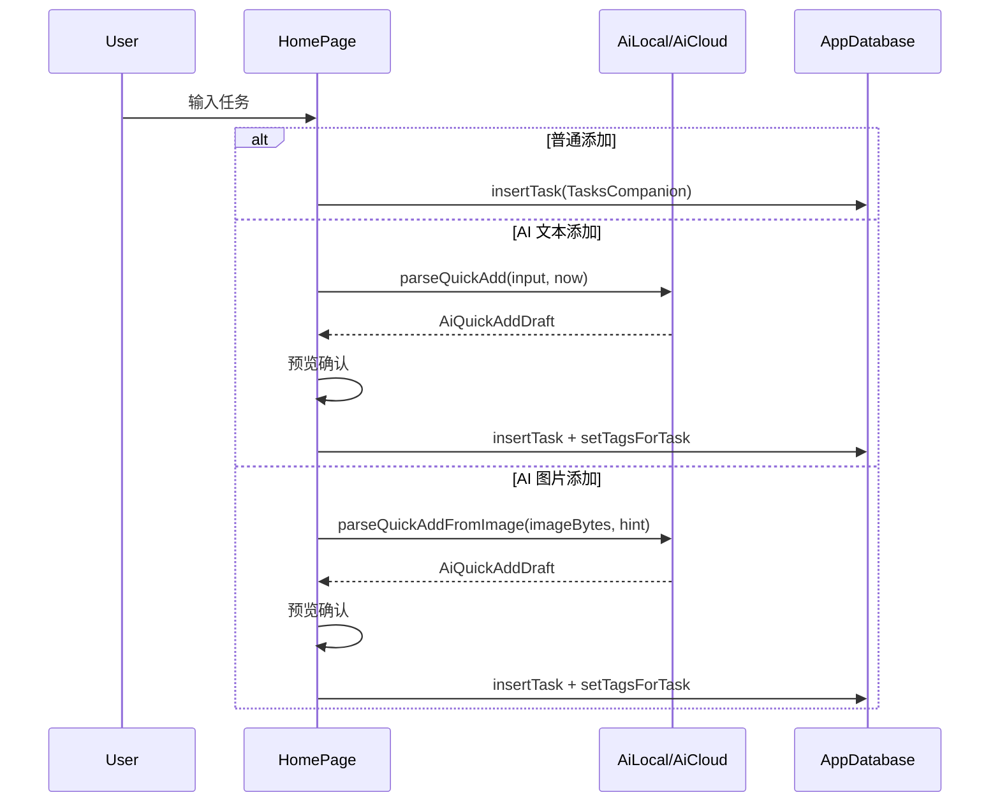

# FlowLog 当前功能技术架构

更新时间：2026-05-08

本文档描述当前代码库中已经落地的功能与技术架构。它不同于长期目标架构，重点记录现有 Flutter 客户端、macOS 集成、本地数据层、AI、通知和任务视图的实际实现状态。

> **关于 M1 重构（对齐 Things + 多端化）**：本文档仍以"现状"为主，每章节末尾用 "**M1 计划**" 小段标注即将到来的改动。M1 详细设计见 `flowlog_design/refactor/00_Overview.md` 与 `M1_01` ~ `M1_05`。

## 1. 当前实现范围

当前可运行主体是 Flutter 客户端，重点支持 macOS 桌面端，同时保留 Android/iOS 依赖与通知能力。

已实现能力：

- 本地任务管理：今天、任务箱、计划、项目、标签、搜索、回收站。
- 任务属性：标题、备注、优先级、截止时间、全天、重复规则、子任务、完成状态、软删除。
- 计划视图：以今天为锚点，前后 7 天按日历日展示，超出范围按月分组。
- 快速添加：当前页、任务箱、今天三种目标；支持 AI 文本解析和云端图片解析。
- AI 能力：本地 Ollama 风格接口、OpenAI 兼容云端接口、AI 聊天、周报/摘要生成。
- 通知提醒：每日汇总、到期前提醒、到期时提醒、日报/周报提醒。
- macOS 全局快捷键：通过 Flutter MethodChannel 调用原生 Carbon HotKey。
- 设置：主题、语言、通知、快捷键、AI 配置、首次启动引导。
- 打包：`flutter build macos` 生成 `FlowLog.app`。

未完全落地或仍偏规划：

- 服务端同步、账号、设备配对、WebSocket 增量同步目前只有 Maven 模块骨架和设计文档。
- `Tasks.serverId`、`Tasks.isDirty` 已为同步预留，但当前客户端仍以本地 Drift 数据库为主。
- iOS 工程尚未创建（`client/ios/` 不存在）；Android 仅 `flutter create` 骨架。
- UI 体系仍是"今天/任务箱/计划/AI/我的"五项，未对齐 Things 的 Inbox/Today/Upcoming/Anytime/Someday/Logbook。
- 数据模型缺 Area / Heading / Checklist；Tasks 无 `whenType` / `deadline` / `reminderAt`。

**M1 计划**：补齐 iOS 工程与 Android 配置，引入 Things 五级数据模型与三轴时间字段，重写顶层 Shell 为三档自适应，集中管理主题 token。详见 `refactor/00_Overview.md`。

## 2. 技术栈

### 2.1 客户端

- Flutter / Dart：主 UI、状态管理、业务流程。
- Provider：依赖注入与全局设置监听。
- Drift + SQLite：本地关系型存储。
- SharedPreferences：轻量设置持久化。
- flutter_local_notifications + timezone：本地通知调度。
- file_picker：AI 图片快速添加。
- macOS Swift + MethodChannel：启动占位层、全局快捷键。

### 2.2 服务端骨架

- Maven 多模块：`common`、`web-server`、`sync-server`。
- `web-server`：Spring Boot Web / JPA / Security / Redis / MySQL 依赖已声明。
- `sync-server`：Akka Typed / Akka Stream / Akka HTTP 依赖已声明。
- 当前仓库尚未实现完整服务端业务模型和同步协议。

## 3. 运行时组件关系



## 4. 应用启动流程

入口文件：`client/lib/main.dart`

1. 初始化 Flutter binding。
2. 创建 `SharedPreferences`、`AppDatabase`、`AppSettings`、`AppCommandBus`。
3. 通过 `MultiProvider` 注入数据库、设置、AI 服务、命令总线。
4. `AppBootstrap` 在首帧后绑定：
   - `NotificationService.instance.bind(...)`
   - `GlobalHotkeyService.instance.bind(...)`
   - macOS `flowlog/launch` ready 信号。
5. `FlowLogApp` 根据 `settings.onboardingCompleted` 决定进入 `HomePage` 或 `OnboardingPage`。

## 5. UI 信息架构

核心容器：`client/lib/ui/home/home_page.dart`（约 1300 行，自绘 Sidebar + IndexedStack）

桌面端采用左侧栏 + 右侧 `IndexedStack`：

- 今天：`TodayPage`
- 任务箱：`InboxPage`
- 计划：`UpcomingPage`
- AI：`AiChatPage`
- 我的：`ProfilePage`

移动端使用 `BottomNavigationBar`，与桌面索引保持一致。当前断点为 800px 一刀切。

辅助入口：

- 搜索：`showTaskSearchPanel`
- 回收站：`TrashPage`
- 设置：`SettingsPage`
- 项目：`ProjectPage` / `ProjectManagePage`
- 标签：`TagPage` / `TagManagePage`

**M1 计划**：

- `home_page.dart` 标记 `@Deprecated`，由 `lib/ui/shell/adaptive_shell.dart` 替换。
- 三档断点：`< 600 / 600–1000 / ≥ 1000` 分别对应 `MobileShell` / `TabletShell` / `DesktopShell`（详见 `refactor/M1_04`）。
- 桌面端引入常驻 `DetailPane`，由 `SelectionStore` 协调 Sidebar / List / Detail 三栏。
- Sidebar 改为 Things 风格 6 项固定视图（Inbox/Today/Upcoming/Anytime/Someday/Logbook）+ 动态 Areas/Projects + 工具入口（Trash/Settings）。
- M1 阶段保留 `TodayPage` / `InboxPage` / `UpcomingPage` 内嵌入新 Shell；M2 才进入视图层重写。

## 6. 数据模型

数据表定义：`client/lib/database/tables.dart`



任务状态：

- `0`：待办
- `1`：已完成
- `2`：已删除，进入回收站

同步预留字段：

- `serverId`：服务端 ID 回填。
- `isDirty`：本地变更待同步标记。

**M1 计划**：数据模型一次到位对齐 Things。新增三张表 + Tasks/Projects 字段扩展（详见 `refactor/M1_01_Data_Model.md`）：



新增的关键概念：

- **whenType**：`0=none / 1=today / 2=thisEvening / 3=someday / 4=scheduled`，与 dueDate 协同。
- **deadline**：与 whenType 解耦的截止日。
- **reminderAt**：与 dueDate 解耦的提醒时刻。
- **Checklist** ≠ Subtask：前者是任务内勾选清单（不进入视图），后者仍走 `Tasks.parentId`。

## 7. 数据访问层

核心文件：`client/lib/database/database.dart`

主要查询：

- `watchTodayTasks()`：今天任务 + 逾期未完成任务。
- `watchInboxTasks()`：无截止日期、无项目、未完成、非子任务的任务箱任务。
- `watchPlanTasks()`：所有有截止日期、未完成、非子任务任务，用于计划日历。
- `watchUpcomingTasks()`：明天及之后的未完成任务，用于通知弹窗和部分旧逻辑。
- `watchTasksForDate(day)`：指定日期任务。
- `watchDeletedTasks()`：回收站任务。
- `watchSubtasks(parentId)`：子任务。
- `watchTasksByProject(projectId)` / `watchTasksByTag(tagId)`：项目和标签筛选。

主要写操作：

- `insertTask(...)`
- `updateTask(...)`
- `toggleTaskStatus(id, isDone)`
- `deleteTask(id)`：软删除任务及其直接子任务。
- `restoreTask(id)`：从回收站恢复任务及其直接子任务。
- `permanentlyDeleteTask(id)`：永久删除任务、直接子任务和标签关联。
- `setTagsForTask(taskId, tagIds)`
- `createProject/updateProject/deleteProject`
- `createTag/updateTag/deleteTag/updateTagSortOrders`

**M1 计划**新增查询：

- `watchTodayWithEvening()`：返回 `(morning, evening, overdue)` 三段。
- `watchAnytimeTasks()` / `watchSomedayTasks()` / `watchLogbook()`：Things 三个新视图。
- `watchAreas()` / `watchProjectsByArea(areaId?)` / `watchHeadings(projectId)` / `watchChecklist(taskId)`。
- `watchProjectProgress(projectId)`：返回 `(done, total)` 用于侧边栏进度环。
- `watchTasksByHeading(headingId)`：项目页分节渲染。

**M1 计划**新增写入 API（强制原子更新 whenType + dueDate）：

- `setTaskWhen(taskId, WhenType, {DateTime? date})`
- `setTaskDeadline(taskId, DateTime?)` / `setTaskReminder(taskId, DateTime?)`（同时调度通知）
- `moveTaskToProject(taskId, projectId, {String? headingId})`
- `reorderTasks(List<String> idsInOrder)`：拖拽排序
- `insertChecklistItem` / `toggleChecklistItem` / `reorderChecklist`
- `insertHeading` / `archiveHeading` / `reorderHeadings`
- `insertArea` / `reorderAreas`

## 8. 核心功能流程

### 8.1 快速添加

触发来源：

- 桌面/移动端浮动按钮。
- macOS 全局快捷键。
- `AppCommandBus.quickAddStream`。

流程：



### 8.2 计划日历

文件：`client/lib/ui/upcoming/upcoming_page.dart`

数据源：`db.watchPlanTasks()`

视图模型：

- `today - 7 days` 到 `today + 7 days`：固定生成 15 个 `_DayGroup`，即使没有任务也展示日期与星期。
- 早于范围起点：按月份归入 `pastMonths`。
- 晚于范围终点：按月份归入 `futureMonths`。
- 首次构建后用 `Scrollable.ensureVisible` 自动定位到今天。

### 8.3 回收站

文件：`client/lib/ui/trash/trash_page.dart`

- `watchDeletedTasks()` 展示软删除任务。
- “恢复”调用 `restoreTask(id)`。
- 永久删除按钮调用 `permanentlyDeleteTask(id)`，同时清理 `TaskTags` 关联。

### 8.4 通知调度

文件：`client/lib/services/notification_service.dart`

绑定数据源：

- `db.watchActiveTasks()` 获取所有未删除任务。
- `AppSettings` 监听通知开关、提醒时间、提醒声音等。

调度策略：

- 每次任务或设置变化后 300ms debounce。
- 先 `cancelAll()`，再按当前设置重建通知。
- 支持每日 17:00 汇总、到期前 30 分钟、到期时、日报、周报。

### 8.5 macOS 全局快捷键

Dart 侧：

- `GlobalHotkeyService`
- MethodChannel：`flowlog/hotkey`

macOS 侧：

- `MainFlutterWindow.swift`
- Carbon `RegisterEventHotKey`

触发后：

1. 原生窗口激活应用。
2. 调用 `hotKeyChannel.invokeMethod("trigger", arguments: ["target": "inbox"])`。
3. Dart 侧转发到 `AppCommandBus`。
4. `HomePage` 弹出快速添加框。

**M1 计划**：把 `GlobalHotkeyService` 重构为接口，macOS 实现移到 `global_hotkey_service_macos.dart`，iOS / Android 走 `_NoopHotkeyService` 空实现降级，避免硬依赖 `Platform.isMacOS`。详见 `refactor/M1_02_iOS_Setup.md` §8。

## 9. AI 架构

### 9.1 本地 AI

文件：`client/lib/services/ai_local_service.dart`

- 默认 endpoint：`http://localhost:11434`
- 模型列表：`GET /api/tags`
- 文本解析/摘要：`POST /api/generate`
- 任务解析输出统一为 `AiQuickAddDraft`

### 9.2 云端 AI

文件：`client/lib/services/ai_cloud_service.dart`

- 默认 endpoint：`https://api.openai.com`
- API 形态：OpenAI 兼容 `/v1/chat/completions`
- 支持：
  - 文本快速添加解析
  - 图片快速添加解析
  - AI 聊天回复
  - 周报/摘要生成
  - 连接测试

### 9.3 AI 数据边界

- 快速添加只将用户输入或选择的图片发送给 AI。
- AI 聊天通过本地任务上下文构造 prompt。
- API Key 存于 `SharedPreferences`，当前未接入 Keychain/Keystore。

## 10. 设置与本地化

设置文件：`client/lib/state/app_settings.dart`

持久化内容：

- 通知开关、日报/周报时间、到期提醒、提醒声音。
- 全局快捷键开关和组合键。
- AI provider、本地 endpoint/model、云端 endpoint/API Key/model。
- onboarding 完成状态。

本地化：

- `client/lib/l10n/app_localizations.dart`
- 支持 `zh` 和 `en`。
- 当前默认语言为中文。

## 11. 构建与验证

常用命令：

```bash
cd client
dart format lib/database/database.dart lib/ui/upcoming/upcoming_page.dart lib/ui/home/home_page.dart
flutter analyze
flutter test
flutter build macos
```

当前已验证：

- `flutter test` 通过。
- `flutter analyze` 无 error，但存在既有 info 级提示，例如 `withOpacity` deprecated、`BuildContext` async gap、部分 lint 建议。
- macOS Release 产物路径：`client/build/macos/Build/Products/Release/FlowLog.app`。

## 12. 后续技术演进建议

> 路线图按 M1 → M4 推进，详见 `refactor/00_Overview.md`。本节按"立即可做"与"M 之内"两类列出。

### 12.1 立即可做（与 M1 并行，不阻塞）

- 将云端 API Key 从 `SharedPreferences` 迁移到 Keychain/Keystore。
- 给永久删除增加确认弹窗，降低误删风险。
- 为 `watchPlanTasks()`、回收站永久删除、AI 解析落库增加单元测试。
- 清理 `flutter analyze` info，尤其是 `use_build_context_synchronously` 和 deprecated API（`withOpacity` → `withValues`）。

### 12.2 M1（数据模型 + 多端骨架 + 自适应 Shell + 主题 token）

- 数据模型一次到位：`Areas` / `Headings` / `Checklists` 新表 + Tasks/Projects 字段扩展（`refactor/M1_01`）。
- iOS / iPadOS 工程脚手架 + Info.plist + 通知 / 热键平台抽象（`refactor/M1_02`）。
- Android SDK 升级 + 权限 + Material You + 通知运行时请求（`refactor/M1_03`）。
- `AdaptiveShell` 三档断点 + `Sidebar` + `DetailPane` + `SelectionStore`（`refactor/M1_04`）。
- `lib/theme/` 集中 Spacing / Radii / Elevation / Typography / ColorScheme token（`refactor/M1_05`）。

### 12.3 M2（视图层重写）

- Sidebar 实装动态 Areas / Projects + 圆形进度环。
- 重写 TaskRow：圆形 checkbox + 留白替代 Divider + hover 内联动作。
- Today 改造：This Morning / This Evening 两段 + 逾期置顶。
- Upcoming 改造：迷你月历 + 按天分组列表。
- Anytime / Someday / Logbook 三个新视图实装。
- Project 详情页支持 Heading 分节。
- TaskDetailView 抽出（不含 Scaffold），mobile 全屏 push、desktop 嵌入 DetailPane。

### 12.4 M3（交互打磨）

- Quick Entry 全局悬浮卡（macOS 已有热键，UI 重写）。
- 拖拽排序（`ReorderableListView` + sort_order 重排）。
- Magic Plus（移动端拖拽插入位置）。
- 多选与批量操作。
- Markdown notes 编辑器（评估 `flutter_quill` / `super_editor`）。
- Checklist 编辑 UI。
- 把同步预留字段接入真正 Sync Queue。
- 通知调度拆分为可测试的纯函数策略层。

### 12.5 M4（视觉 + 平台细节）

- 字体平台分化（iOS SF / Android Roboto / 桌面系统字体）。
- macOS 隐藏 titlebar + 菜单栏整合。
- Windows 评估亚克力背景与无边框窗口。
- 动画打磨（圆形 checkbox 渐变、拖拽阴影）。
- Apple Watch / 锁屏小组件评估（需要原生 target）。
- 重新评估品牌主色（保持粉色 vs 改 Things 蓝）。

### 12.6 服务端演进（与客户端并行）

- 明确 `common` 模块的数据协议（含新表 Area / Heading / Checklist）。
- 在 `web-server` 落地设备注册、设置、认证接口。
- 在 `sync-server` 落地 WebSocket / Protobuf 增量同步。
- 定义冲突处理策略和 `isDirty/serverId` 的同步状态机。
